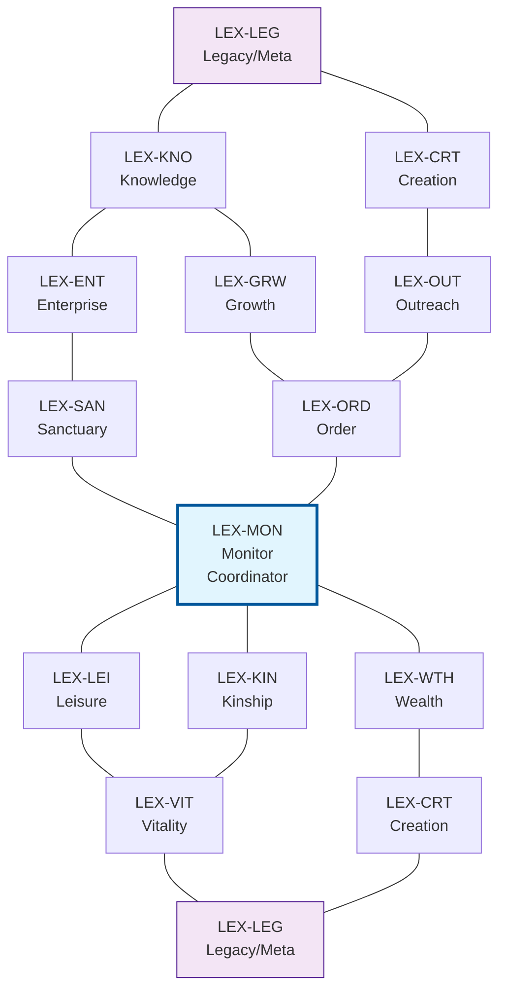
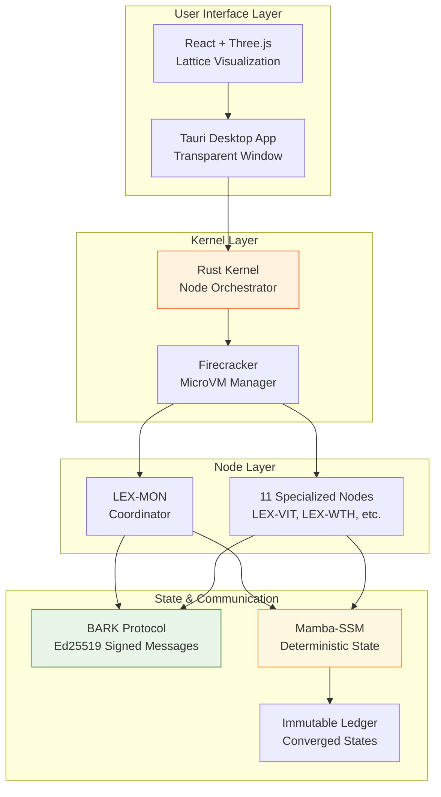

# Axiom Crucible: The Glass Monolith Architecture

## Overview

The Axiom Crucible implements a deterministic lattice topology with 12 specialized nodes operating within isolated Firecracker microVMs. The system uses Mamba-2 state-space models for zero-entropy state management, BARK Protocol for authenticated inter-node communication, and a Tauri-based kernel with React + Three.js visualization interface.

## Core Architecture Principles

- **Deterministic Operation**: Zero-temperature Mamba-SSM ensures reproducible state transitions
- **Lattice Topology**: 12-node hexagonal lattice with LEX-MON as central coordinator
- **Isolated Execution**: Each node runs in Firecracker microVM for security and performance
- **Authenticated Communication**: Ed25519-signed BARK Protocol directives and responses
- **State Convergence**: Immutable ledger for converged states requiring human validation

## 12-Node Lattice Topology



### System Architecture Overview



### Node Functions

- **LEX-MON**: Central coordination router, directive orchestration, response synthesis
- **LEX-VIT**: Vitality monitoring, bio-state analysis, health metrics
- **LEX-WTH**: Financial analysis, runway calculations, wealth management
- **LEX-ENT**: Strategic enterprise planning, pivot analysis, business logic
- **LEX-KNO**: Knowledge processing, data analysis, information synthesis
- **LEX-CRT**: Content creation, output generation, creative synthesis
- **LEX-ORD**: Logistics coordination, scheduling, operational planning
- **LEX-KIN**: Social relationship management, network analysis, kinship tracking
- **LEX-GRW**: Learning and growth, capability development, skill acquisition
- **LEX-SAN**: Environmental monitoring, infrastructure management, sanctuary optimization
- **LEX-LEI**: Leisure and recovery, restoration planning, wellness management
- **LEX-OUT**: Communication outreach, influence management, external relations

## Directory Structure

```text
axiom-crucible/
├─ nodes/                          # 12 specialized node implementations
│  ├─ lex-mon/                     # Central coordinator
│  ├─ lex-vit/                     # Vitality monitoring
│  ├─ lex-wth/                     # Wealth/financial analysis
│  ├─ lex-ent/                     # Enterprise strategy
│  ├─ lex-kno/                     # Knowledge processing
│  ├─ lex-crt/                     # Content creation
│  ├─ lex-ord/                     # Logistics/operations
│  ├─ lex-kin/                     # Social relationships
│  ├─ lex-grw/                     # Growth/learning
│  ├─ lex-san/                     # Environment/sanctuary
│  ├─ lex-lei/                     # Leisure/recovery
│  ├─ lex-out/                     # Outreach/communication
│  └─ lex-leg/                     # Legacy/meta-analysis
├─ shared/                         # Cross-node shared libraries
│  ├─ communication/               # BARK Protocol implementation
│  │  ├─ src/lib.rs               # Protocol definitions, signing
│  │  └─ Cargo.toml
│  ├─ state/                       # Mamba-SSM state management
│  │  ├─ src/lib.rs               # State vectors, transitions, ledger
│  │  └─ Cargo.toml
│  └─ models/                      # Mamba-2 model implementations
├─ kernel/                         # Tauri + Rust core runtime
│  ├─ src/main.rs                  # Node launcher, VM management
│  ├─ Cargo.toml                   # Tauri dependencies
│  └─ tauri.conf.json              # Desktop app configuration
├─ ui/                             # React + Three.js interface
│  ├─ src/
│  │  ├─ App.tsx                   # Main 3D visualization
│  │  ├─ components/               # Lattice visualization, node status
│  │  └─ hooks/                    # Tauri IPC hooks
│  ├─ package.json
│  └─ vite.config.ts
├─ firecracker/                    # MicroVM orchestration
│  ├─ configs/                     # VM configurations per node
│  ├─ images/                      # Base VM images
│  └─ orchestration/               # VM lifecycle management
├─ deployment/                     # Hardware-specific optimizations
│  ├─ nvidia/                      # CUDA kernels, TensorRT
│  ├─ apple-silicon/               # Metal shaders, CoreML
│  └─ optimize.sh                  # Build optimization script
├─ tests/                          # Integration and communication tests
│  └─ inter_node_communication_test.rs
└─ docs/                           # Architecture documentation
   ├─ bark-protocol.md
   ├─ mamba-ssm.md
   └─ lattice-topology.md
```

## Key Components

### BARK Protocol Communication System

**Core Features:**
- Directive-based messaging (ANALYZE, GENERATE, VERIFY, EXECUTE_PLAN, VALIDATE_OUTPUT)
- Ed25519 cryptographic signing for authenticity
- JSON serialization with canonical message construction
- Response status tracking (Success, Failure, Pending, Rejected)

**Integration Points:**
- Each node implements `process_directive()` for incoming messages
- LEX-MON routes directives based on keyword analysis
- State updates trigger convergence checks and ledger commits

### Mamba-SSM State Management

**Mathematical Foundation:**
```
h_t = A × h_(t-1) + B × u_t
```

**Key Features:**
- Deterministic state transitions (temperature = 0.0)
- Convergence detection with immutable ledger commits
- Node-specific state initialization vectors
- State similarity calculations for decision making

**Integration Points:**
- StateManager handles all 12 nodes' persistent state
- Convergence triggers human validation workflows
- State snapshots for backup/restore operations

### Firecracker MicroVM Orchestration

**Architecture:**
- Each node runs in isolated microVM
- Kernel manages VM lifecycle (launch, monitor, terminate)
- Inter-VM communication via vsock or shared memory
- Resource allocation based on node requirements

**Integration Points:**
- Kernel spawns VMs on startup
- Health monitoring through VM introspection
- State persistence across VM restarts

### Tauri Desktop Application

**Configuration:**
- Transparent window (800x600, no decorations)
- Local development server on port 1420
- Native system integration for hardware access
- IPC bridge to Rust kernel

**Integration Points:**
- UI receives real-time node status updates
- User interactions trigger directive dispatch
- 3D lattice visualization shows system state

### React + Three.js Visualization

**Components:**
- Hexagonal lattice representation
- Node status indicators (color-coded health/load)
- Directive flow animations
- State convergence visualizations

**Integration Points:**
- Tauri IPC for bidirectional communication
- Real-time updates from kernel state
- User gestures translate to system directives

## Integration Points

### Node Communication Flow
1. User interaction → UI component → Tauri IPC → Kernel
2. Kernel creates signed BARK directive → Routes to target node(s)
3. Node processes directive → Updates Mamba-SSM state
4. Response synthesis → UI visualization update

### State Management Integration
1. Node operations trigger state transitions
2. Convergence detection → Immutable ledger commit
3. Ledger changes → UI state synchronization
4. Human validation required for critical convergences

### Hardware Acceleration
1. NVIDIA: CUDA kernels for Mamba-2 inference
2. Apple Silicon: Metal shaders for visualization
3. CPU fallback for compatibility

## Implementation Approach

### Phase 1: Core Infrastructure
- Implement BARK Protocol with full signing/verification
- Complete Mamba-SSM state management system
- Set up Tauri application skeleton

### Phase 2: Node Development
- Implement all 12 node types with basic functionality
- Integrate state management per node
- Develop communication routing logic

### Phase 3: VM Orchestration
- Configure Firecracker microVMs
- Implement VM lifecycle management
- Add inter-VM communication channels

### Phase 4: UI Development
- Build Three.js lattice visualization
- Implement real-time status updates
- Add user interaction workflows

### Phase 5: Optimization & Testing
- Hardware-specific optimizations
- Comprehensive integration testing
- Performance benchmarking

## Dependencies

**Rust Ecosystem:**
- `tauri` - Desktop application framework
- `tokio` - Async runtime
- `serde` - Serialization
- `chrono` - Time handling
- `uuid` - Unique identifiers
- `ed25519-dalek` - Cryptographic signing

**Frontend:**
- `react` - UI framework
- `three.js` - 3D visualization
- `@tauri-apps/api` - IPC communication

**System:**
- Firecracker - MicroVM runtime
- CUDA/TensorRT (optional) - GPU acceleration
- Metal/CoreML (macOS) - Apple Silicon optimization
